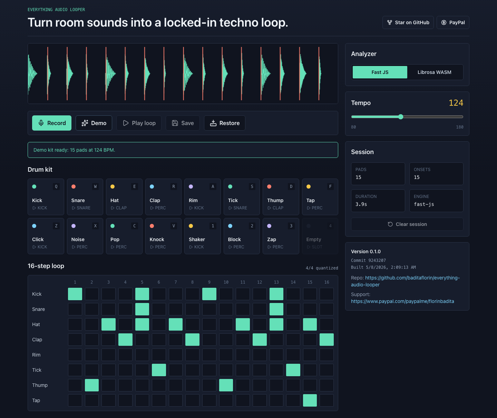
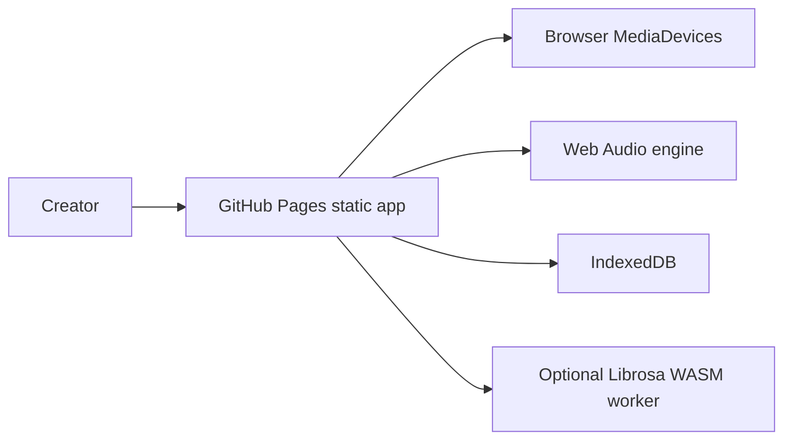

# Everything Audio Looper


Live app: https://baditaflorin.github.io/everything-audio-looper/

Repository: https://github.com/baditaflorin/everything-audio-looper

Support: https://www.paypal.com/paypalme/florinbadita

Record everyday sounds and turn them into a synced browser-based drum kit and techno loop.



Everything Audio Looper records claps, taps, clicks, and short room sounds, detects transients and tempo locally, chops the recording into pads, and generates a 16-step beat. It is a pure GitHub Pages app: no backend, no accounts, and no uploaded recordings.

## Quickstart

```sh
npm install
make dev
```

Build the public Pages bundle:

```sh
make build
make smoke
```

Install local git hooks:

```sh
make install-hooks
```

## Architecture



Architecture docs:

docs/architecture.md

ADRs:

docs/adr/

Deploy guide:

docs/deploy.md

Privacy:

docs/privacy.md

## Features

- Browser microphone recording and demo-kit fallback.
- Fast TypeScript onset/BPM detection with optional lazy Librosa WASM worker.
- Automatic pad slicing, keyboard-triggerable pads, and a 16-step techno pattern.
- Local save/restore through IndexedDB.
- PWA build with GitHub Pages base path, version, commit, repository, and PayPal links visible in the app.

## Quality Gates

```sh
make lint
make test
make build
make smoke
```
