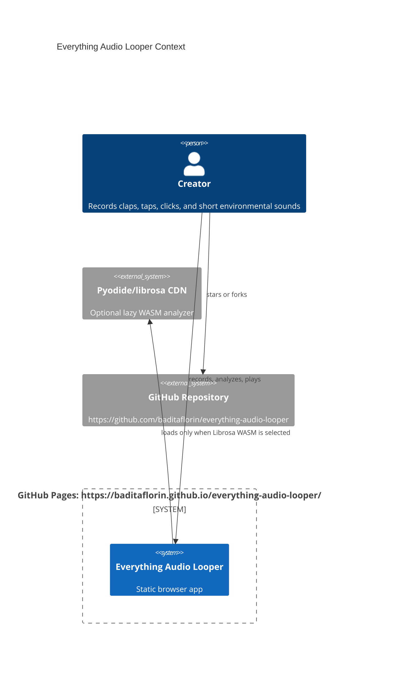
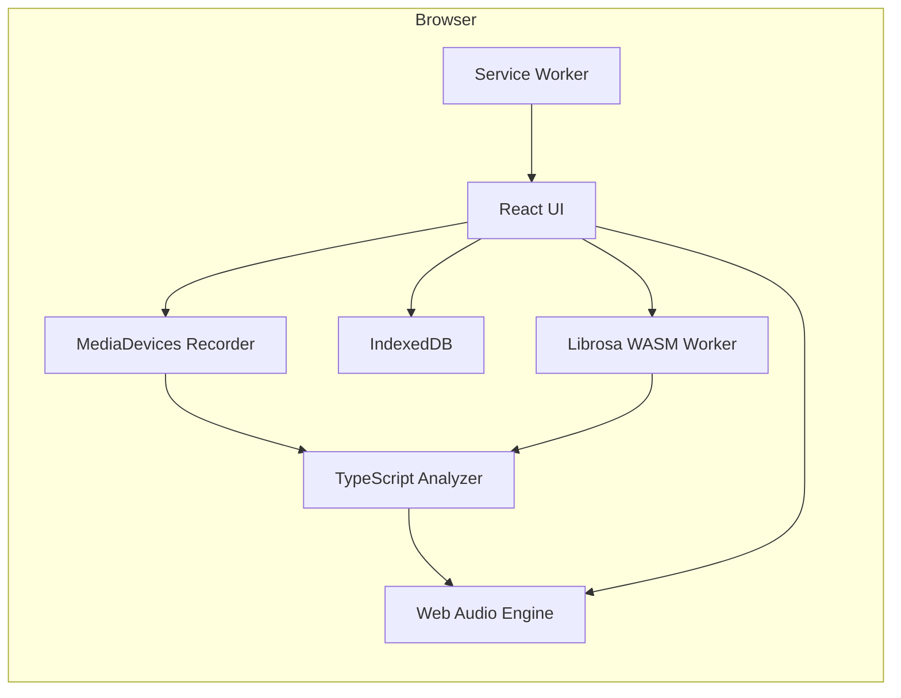

# Architecture

Everything Audio Looper is a Mode A static GitHub Pages application.

## Boundaries

- UI state lives in `src/features/looper`.
- DSP, slicing, BPM estimation, and playback live in `src/features/audio`.
- Persistence lives in `src/features/storage`.
- Optional WASM analysis lives in `src/workers`.

No backend, server database, auth service, or runtime secret store exists in v1.

